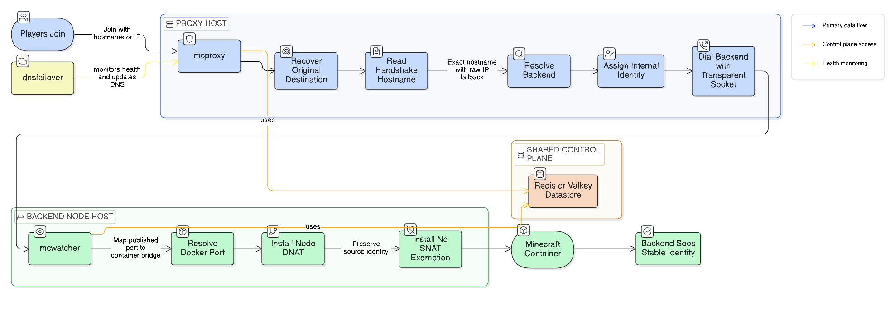

<p align="center">
  
</p>

<h1 align="center">sidero-proxy</h1>

<p align="center">
  Linux-native Minecraft ingress, hostname routing, and identity-preserving proxying.
</p>

<p align="center">
  Made for <strong>Siderocloud</strong> · <code>siderocloud.net</code>
</p>

<p align="center">
  <code>Linux only</code>
  <code>Minecraft Java</code>
  <code>nftables</code>
  <code>advanced ops</code>
</p>

`sidero-proxy` is a Linux-native ingress and identity-preserving proxy system for Minecraft server fleets.

Use it when you need:

- Minecraft-aware ingress routing
- kernel-level source identity handling
- Docker-aware backend node translation
- more control than a normal TCP reverse proxy gives you

Skip it if all you need is:

- a clean hostname
- SRV automation
- ordinary `IP:port` hosting
- a simple front door with no identity-preservation requirements

## Architecture



It was built for a very specific problem:

- public node IPs were being given directly to players
- those node IPs became the DDoS blast surface
- backend Minecraft servers needed to continue seeing stable client IP-like identities for moderation and ban workflows

The project combines:

- transparent-source backend dialing
- nftables-based interception and NAT
- hostname-based Minecraft routing
- backend-node container DNAT helpers
- optional DNS failover automation

It is not a generic reverse proxy. It is an opinionated system for Minecraft operators who need kernel-level control over how player traffic reaches backend servers.

## What It Does

At a high level, `sidero-proxy` can:

- accept player traffic on public proxy IPs
- recover the original destination IP and port
- read the Minecraft Java handshake hostname
- route a connection by exact ingress hostname, with raw-IP fallback
- connect to backend nodes using transparent source addresses
- preserve a stable per-player internal identity at the backend
- install backend-node DNAT rules so published Docker containers can still be reached through private routing
- optionally update Cloudflare DNS for regional failover

Runtime binaries:

- `mcproxy`
  - public ingress proxy
- `mcwatcher`
  - backend-node helper for ban promotion and Docker/container DNAT maintenance
- `dnsfailover`
  - optional DNS failover controller

## Why This Exists

The original production need was:

- hide backend node public IPs from players
- centralize exposure at proxy IPs
- preserve backend-visible identities well enough for IP-based moderation logic

That led to a design where:

- players connect to a proxy
- the proxy assigns a stable synthetic internal IP from a proxy-owned subnet like `<PROXY_SUBNET_A>`
- the backend sees that synthetic identity instead of the proxy host IP

This is useful when:

- you cannot modify user-controlled Minecraft servers
- you cannot require plugins or Proxy Protocol support
- you still need the backend to see something stable and player-specific

## Current Feature Set

### 1. Transparent-source backend dialing

`mcproxy` uses Linux transparent sockets to open backend connections from non-local source addresses.

This is the basis for preserving backend-visible player identity rather than exposing only the proxy host IP.

### 2. Hostname-based Minecraft routing

The proxy reads the initial Java Edition handshake and routes by exact hostname.

This lets many ingress hostnames share the same proxy IP and the same public port.

Example:

- `<INGRESS_HOST_A>` -> backend A
- `<INGRESS_HOST_B>` -> backend B

The client joins by hostname, but the proxy chooses the backend from the hostname in the Minecraft handshake.

### 3. Raw-IP fallback

If a client connects by raw IP and the handshake reflects that, the proxy can fall back to original-destination-IP based routing.

### 4. Backend node Docker/container support

When backend game servers are published through Docker on a node, `mcwatcher` can:

- resolve published host ports to container bridge IPs
- install node-side DNAT to the container endpoint directly
- install no-SNAT exemptions so the backend server sees the intended source identity rather than the Docker bridge gateway

### 5. Regional DNS failover

`dnsfailover` can monitor proxy health and update Cloudflare DNS records to move hostnames from a failed regional proxy to a fallback region.

## What This Project Is Good For

This project makes sense if you have a real need for one or more of these:

- a Minecraft-specific proxy layer with hostname-based routing
- preserving stable backend-visible identities without modifying user-owned servers
- routing through private infrastructure while fronting public player traffic elsewhere
- Docker-backed backend nodes where direct node-to-container translation must be maintained automatically
- a self-hosted edge design where Linux networking behavior is part of the solution

Typical fit:

- providers with multiple backend nodes
- operators who need more control than ordinary TCP reverse proxies provide
- platforms that want Minecraft-aware routing and kernel-assisted identity handling

## What This Project Is Not

This project is probably the wrong tool if all you need is:

- a clean hostname for a server
- basic DNS automation
- SRV record generation
- ordinary per-server `IP:port` hosting

If your environment already has strong upstream DDoS protection and customers are fine with:

- a provider-managed subdomain
- SRV records pointing to the node's real port

then a much simpler system may be better than deploying this proxy.

In particular, if the only product goal is:

- "give every server a nice hostname"

you may not need a kernel-heavy multiplexer at all.

## Design Constraints

This project assumes Linux and root.

It depends on:

- `nftables`
- `iproute2`
- transparent socket capabilities such as `IP_TRANSPARENT`

It is intentionally Linux-specific in the dataplane.

It also assumes Minecraft Java Edition semantics for handshake-based hostname routing. The hostname mux design is not automatically transferable to every other game protocol.

## Architecture Notes

The important architectural idea is that the proxy transport identity and the backend-visible identity are not the same thing conceptually.

In the current production-oriented design:

- the proxy transport path uses a synthetic internal subnet such as `<PROXY_SUBNET_POOL>`
- backend nodes route those proxy subnets privately
- node-local NAT and no-SNAT rules are used so Docker does not destroy the intended source identity

This is why the system can preserve stable identities even when traffic crosses proxies, private routing, and container bridges.

## Status

This repository reflects a working system built for a real hosting platform and evolved under production pressure.

It includes:

- code
- deployment examples
- cleaner deployment documentation
- stage-by-stage notes from development and testing

It should still be treated as infrastructure software for advanced operators, not as plug-and-play consumer software.

## Documentation

Recommended reading:

- [DEPLOYMENT_CLEAN.md](docs/DEPLOYMENT_CLEAN.md)
- [DEPLOYMENT.md](docs/DEPLOYMENT.md)
- [HOSTNAME_MULTIPLEXING.md](docs/HOSTNAME_MULTIPLEXING.md)

## Building

From the repo root:

```bash
GOCACHE=/tmp/go-build go test ./...
GOCACHE=/tmp/go-build go build ./cmd/proxy ./cmd/watcher ./cmd/dnsfailover
```

## Open Source Intent

This is being published because there may be operators with a real need for the current system:

- Minecraft server fleets
- private-routing backends
- hostname-aware routing
- identity-preserving proxying without server modifications

If your use case is simpler, use something simpler.

If your use case is this exact kind of ugly networking problem, this repository may save you a lot of time.

## Credits

Built with a whole lot of pain, thinking, prompting, and our AI overlords:

- Codex
- Claude
